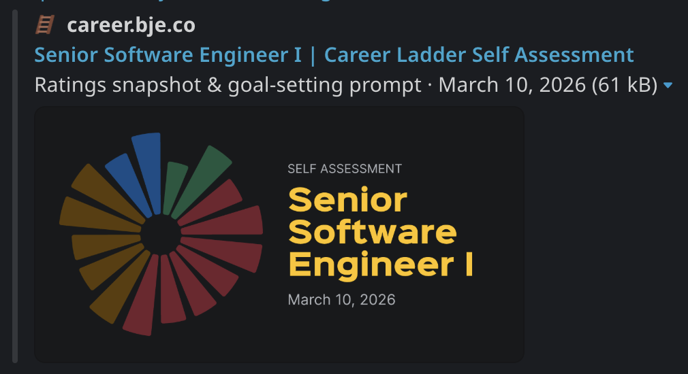

# Career Growth Self-Assessment

A self-assessment tool for engineers to rate themselves against the attributes of their target career level, identify their highest-impact growth opportunities, and generate SMART goals with an LLM.

## About the App

This app supports the first two parts of a three-part career growth framework: rating yourself against the attributes of your target level, and identifying your highest-impact opportunities. The third part, partnering for execution with your manager or mentor, happens outside the app.

## Get Started

1. Select your target career level from the dropdown in the header.
2. Rate yourself on each attribute using Never, Rarely, Sometimes, or Always.
3. Review the Opportunities tab to see your lowest-rated attributes sorted by impact.
4. Open the Goal Prompt tab and copy the generated prompt.
5. Paste the prompt into any LLM (Claude, ChatGPT, etc.) to craft your SMART goals for the quarter.
6. Save your URL: paste it into a Slack DM to yourself so you can return next quarter.

## Rating Scale

| Rating | Meaning |
|--------|---------|
| **Never** | This behavior doesn't show up in your work |
| **Rarely** | It happens, but not consistently |
| **Sometimes** | You do this, but not yet reliably |
| **Always** | This is a consistent, observable pattern in your work |

## Saving Assessments

This app is stateless: your ratings are encoded in the URL. To save your assessment, paste the URL into a Slack DM to yourself. Apps that support link previews will unfurl it into a card showing your ratings chart, target level, and the date of your assessment, making it easy to find later. When you come back, your full assessment loads instantly so you can pick up where you left off or reuse the goal prompt without starting over.

